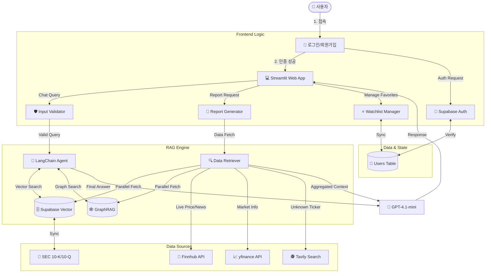

# 02. 시스템 아키텍처 (System Architecture)

## 📌 개요
본 프로젝트는 **Hybrid RAG (Vector Search + Graph Analysis)** 기반의 금융 분석 챗봇 시스템입니다.

## 🏗️ 전체 아키텍처



### 1. Frontend (User Interface)
- **Framework**: Streamlit
- **Features**: 
  - 실시간 채팅 인터페이스 (`AnalystChatbot`)
  - 대화형 차트 및 데이터 시각화
  - 사용자 및 관심 기업 관리 (Sidebar)

### 2. Backend & AI Engine
- **RAG Engine**:
  - **Vector Store**: 텍스트 의미 검색 (Semantic Search)
  - **GraphRAG**: `NetworkX` 기반의 기업 관계망 분석 (중심성, 최단 경로 탐색)
  - **Hybrid Retrieval**: 벡터 검색 결과와 그래프 분석 결과를 결합하여 답변 생성
- **LLM**: OpenAI GPT-4.1-mini (답변 생성 및 도구 호출)

### 3. Database & Infrastructure
- **Supabase (PostgreSQL)**:
  - `pgvector`: 벡터 임베딩 저장 및 검색
  - `Relational Tables`: 기업 정보, 사용자 정보, 관계 데이터 관리
- **Authentication**: Supabase Auth

## 🔄 데이터 흐름 (Data Flow)

1. **User Query**: 사용자가 질문 입력 (예: "애플의 공급망 리스크는?")
2. **Intent Analysis**: 질문 의도 파악 (일반 대화 vs 분석 요청)
3. **Information Retrieval**:
   - **Vector Search**: 관련 뉴스/보고서 검색 (`documents`)
   - **Graph Search**: 관련 기업 네트워크 및 관계 탐색 (`company_relationships`)
4. **Context Assembly**: 검색된 텍스트와 그래프 정보를 프롬프트로 구성
5. **Generation**: LLM이 분석 결과 생성 및 답변 제공

## 🛠️ 기술 스택 (Tech Stack)
- **Language**: Python 3.10+
- **Graph Library**: NetworkX
- **Key Libraries**: `openai`, `supabase`, `pandas`, `streamlit`

## 📂 프로젝트 구조 (Directory Structure)

```bash
SKN22-3rd-4Team/
├── .streamlit/                 # Streamlit 설정
│   └── secrets.toml            # API 키 및 환경 변수
├── logs/                       # 로그 파일 저장소
├── scripts/                    # 유틸리티 및 배치 스크립트
│   ├── build_company_relationships.py  # [ETL] 기업 관계 추출 및 그래프 구축 (병렬 처리 지원)
│   ├── collect_10k_relationships.py    # (Legacy) 10-K 기반 관계 추출
│   └── upload_to_supabase.py           # 초기 데이터 업로드
├── src/                        # 애플리케이션 핵심 소스 코드
│   ├── core/                   # 코어 비즈니스 로직
│   │   ├── chat_connector.py   # 채팅 세션 및 UI 연결 관리
│   │   └── utils.py            # 공통 유틸리티
│   ├── data/                   # 데이터 관리
│   │   ├── stock_api_client.py # Finnhub/FMP 주식 데이터 API 클라이언트
│   │   └── supabase_client.py  # Supabase DB 클라이언트 (PostgreSQL/pgvector)
│   ├── rag/                    # RAG (Retrieval-Augmented Generation) 엔진
│   │   ├── analyst_chat.py     # 금융 분석가 챗봇 비즈니스 로직
│   │   ├── chat_tools.py       # OpenAI Function Calling 도구 정의
│   │   ├── graph_rag.py        # [CORE] NetworkX 기반 그래프 분석 및 RAG 엔진
│   │   ├── rag_base.py         # RAG 기본 클래스
│   │   └── vector_store.py     # 벡터 검색 (Vector Search) 관리
│   ├── tools/                  # 도구 및 헬퍼
│   │   ├── exchange_rate_client.py # 환율 정보
│   │   └── favorites_manager.py    # 관심 기업 관리
│   └── ui/                     # UI 컴포넌트 (Streamlit)
│       ├── components/         # 재사용 가능한 UI 컴포넌트
│       ├── helpers/            # UI 헬퍼 함수
│       │   ├── chart_helpers.py
│       │   ├── chat_helpers.py
│       │   ├── home_dashboard.py
│       │   ├── insights_helper.py
│       │   └── sidebar_manager.py
│       └── pages/              # 페이지별 UI
│           ├── home.py
│           ├── insights.py     # [MAIN] 채팅 기반 인사이트 페이지
│           ├── login_page.py
│           └── report_page.py
├── app.py                      # 메인 애플리케이션 진입점
├── requirements.txt            # 의존성 패키지 목록
└── STRUCTURE.md                # 프로젝트 구조 문서 (현재 파일)
```
