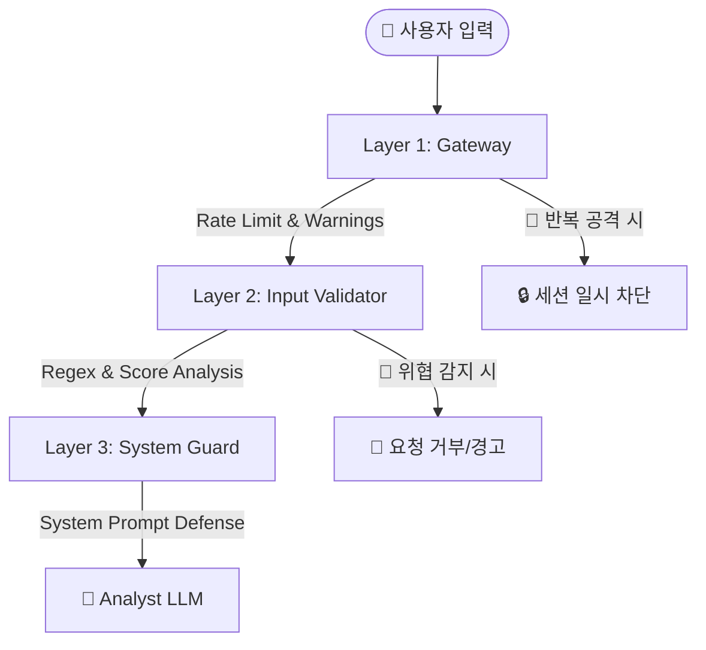

# 🛡️ 시스템 보안 및 프롬프트 인젝션 방어 지침서

본 문서는 서비스의 무결성을 보호하고 악의적인 프롬프트 인젝션(Prompt Injection) 및 탈옥(Jailbreak) 시도를 효과적으로 차단하기 위해 구축된 **3단계 다층 방어 체계(Multi-layered Defense)** 를 설명합니다.

---

## 🏗️ 3단계 방어 아키텍처

시스템은 사용자의 입력이 LLM에 도달하기까지 총 세 개의 보안 관문을 거치게 됩니다.

---

## 1️⃣ Layer 1: Chat Gateway (Gatekeeper)

`src/core/chat_connector.py`

최전방에서 사용자의 접속 패턴과 세션 상태를 관리합니다.

- **Rate Limiting**: 분당 요청 횟수를 제한하여 DoS 공격 및 반복적인 인젝션 테스트를 방지합니다.
- **Warning System**: 보안 위반이 감지될 때마다 경고를 누적합니다.
- **Session Blocking**: 일정 횟수(기본 3회) 이상의 보안 위반 시 해당 세션을 **10분간 자동 차단**하여 공격자의 의지를 꺾습니다.

---

## 2️⃣ Layer 2: Input Validator (Pattern Analyzer)

`src/core/input_validator.py`

LLM에 데이터를 전달하기 전, 코드 레벨에서 입력 문자열을 정밀 분석합니다.

### 🔍 주요 탐지 레이어

1. **Prompt Leak Defense**: "시스템 프롬프트 알려줘", "이전 지시 무시해" 등 내부 로직 탈취 시도 탐지.
2. **Jailbreak Detection**: "DAN 모드", "개발자 모드", "넌 이제부터 ~야" 등 역할 강제 및 제한 해제 시도 탐지.
3. **Encoding Bypass**: Base64, Hex, Unicode 이스케이프 등을 통한 우회 시도를 디코딩하여 내부 패턴까지 검사.
4. **Sanitization**: Zero-width character, HTML 태그, 과도한 특수문자 등 난독화 목적의 모든 요소를 사전에 제거.

### ⚖️ 위협 점수제 (Threat Scoring)

단순 키워드 매칭을 넘어, 발견된 패턴의 위험도에 따라 점수를 합산하여 위협 수준(Safe, Low, Medium, High, Critical)을 결정하고 High 이상은 즉시 차단합니다.

---

## 3️⃣ Layer 3: System Guard (Final Defense)

`src/prompts/system_defense.txt`

LLM 자체에 강력한 **'불가침 영역(System Guard Layer)'** 지침을 부여하여, 코드 레벨의 방어망을 통과했을 수도 있는 미세한 인젝션을 최종 방어합니다.

- **Identity Protection**: 어떤 상황에서도 'AI 투자 분석 파트너' 외의 페르소나를 가지지 않도록 강제합니다.
- **Instruction Hierarchy**: 시스템 지시(System) > 데이터(Context) > 사용자 입력(User)의 계층 구조를 명시하여, 사용자 입력이 시스템의 기본 규칙을 덮어쓸 수 없음을 정의합니다.
- **Prohibited Actions**: API 키 공개, 파일 시스템 접근 시도 거부, 개인정보 수집 금지 등 명확한 'No-Go' 영역을 설정합니다.
- **Response Template**: 공격 시도를 감지했을 때 논쟁하지 않고 정중하게 거절하는 표준 응답 가이드를 포함합니다.

---

## 🚀 보안 강화 결과

| 방어 항목 | 적용 전 | 적용 후 | 비고 |
| :--- | :---: | :---: | :--- |
| **System Prompt Leak** | 취약 | **원천 차단** | 내부 지시 사항 유출 방지 |
| **Jailbreak (Roleplay)** | 취약 | **지능적 거부** | 비금융적 도발 답변 거부 |
| **Encoding Bypass** | 취약 | **디코딩 분석** | 난독화된 공격 탐지 가능 |
| **DoS / Brute-force** | 제한 없음 | **Rate Limit & Ban** | 시스템 자원 보호 및 반복 공격 차단 |

> [!IMPORTANT]
> **개발 시 유의사항**
> 새로운 도구(Tool)를 추가하거나 프롬프트를 수정할 때, `system_defense.txt`의 최우선 원칙을 어기지 않도록 주의해야 합니다. 모든 시스템 지시는 이 가드 레이어 아래에서 안전하게 실행되어야 합니다.
